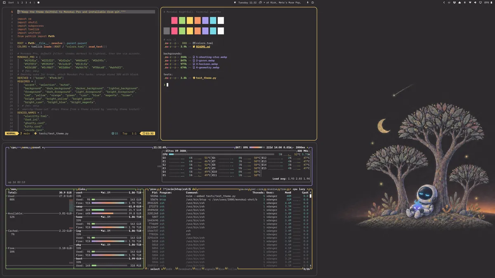

# Monokai Nightfall for Omarchy



Monokai Nightfall is an unofficial Omarchy theme, installed as
`monokai-nightfall`. It uses the modern [Monokai Pro](https://monokai.pro/)
palette (default "Pro" filter) rather than classic Monokai. It ships only
colours and wallpapers, so nothing in it runs code on your machine.

| Role | Colours |
|------|---------|
| Shades, darkest to lightest | `#19181a` `#221f22` `#2d2a2e` `#403e41` `#5b595c` `#727072` `#939293` `#c1c0c0` `#fcfcfa` |
| Accents | red `#ff6188`, orange `#fc9867`, yellow `#ffd866`, green `#a9dc76`, cyan `#78dce8`, purple `#ab9df2` |

Omarchy generates every app's configuration from `colors.toml`: terminals,
Hyprland, the shell, btop, Chromium, Neovim, Helix, VS Code and others. Three
mappings are deliberate:

- Monokai Pro has no blue. Following its official terminal palette, the ANSI
  blue slot is orange, and the bright colours repeat the normal accents.
- The UI accent is Monokai Pro's yellow `#ffd866`, so window borders and
  highlights match the editor theme. File-manager icons use `Yaru-yellow`.
- Omarchy also asks for a brown, which Monokai Pro does not have. It is orange
  mixed 50% with black (`#7e4c34`).

Omarchy already ships `ristretto`, which is based on the warmer Monokai Pro
Ristretto filter. This theme is the default Pro filter.

## Install

Review this repository, then run:

```sh
omarchy theme install https://github.com/krosdai/omarchy-monokai-nightfall-theme.git
```

Or use _Install > Style > Theme_ in the Omarchy menu. Omarchy removes the
`omarchy-` prefix and `-theme` suffix from the repository name, so the theme
appears as `monokai-nightfall`. Installing it also activates it. Update with
`omarchy theme update` and switch themes with the usual picker.

The theme ships no Lua, terminal configs or `vscode.json`. Omarchy would drop
those from a cloned theme anyway, and generates them from the palette instead.
For VS Code or Neovim, the generated themes follow this palette. To use the
official Monokai Pro editor themes, install them yourself.

## Uninstall

Switch to another theme first, then run:

```sh
omarchy theme remove monokai-nightfall
```

This deletes `~/.config/omarchy/themes/monokai-nightfall` and nothing else.

## Development

```sh
python -m unittest discover -s tests -v
uvx ruff check .
uvx ruff format --check .
```

The tests check that the palette is complete and uses only Monokai Pro colours,
and that the repository contains nothing an installed theme would drop. When
Omarchy is installed, they also resolve the palette with
`omarchy-theme-color`, which only reads. Do not switch your desktop theme to
run the tests.

The wallpapers in `backgrounds/` were generated with Codex image generation
from the palette above. The coloured-pencil grove and horizon were then
blended into a flat `#2d2a2e` outside the scene with ImageMagick, so they run
seamlessly behind windows. Monokai Nightfall is not affiliated with or endorsed
by Monokai, the maker of Monokai Pro.
